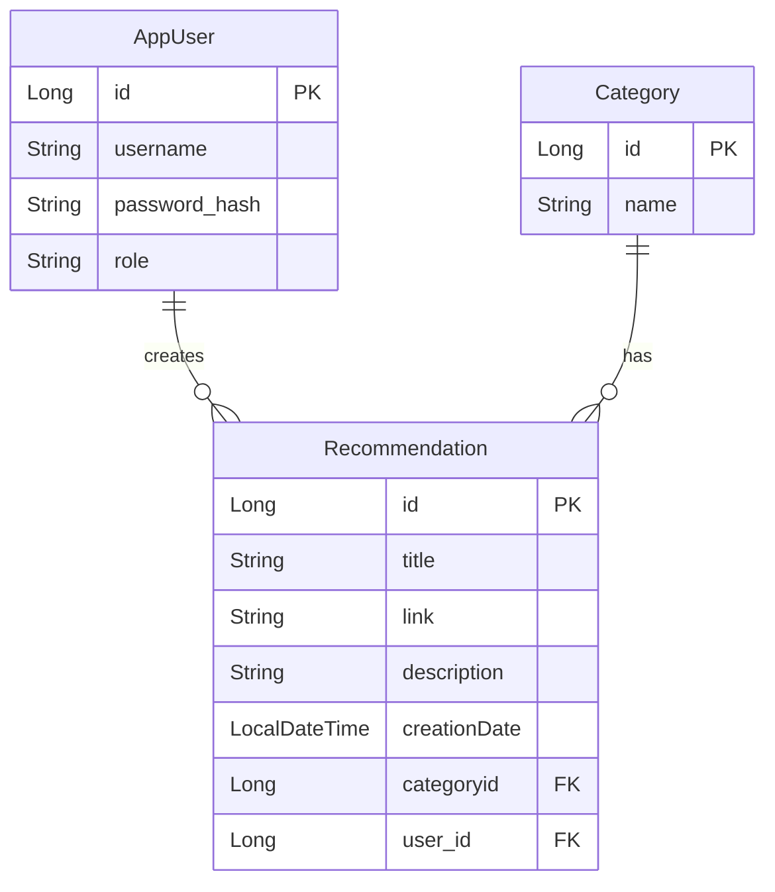

# Entity Relationship Diagram

## Verbal Description

### AppUser
The `AppUser` entity represents a user in the system. Each user has a unique username, a hashed password for security, and a role that defines the user's permissions.

### Category
The `Category` entity represents a grouping for recommendations. Each category has a unique name and can be associated with many recommendations.

### Recommendation
The `Recommendation` entity represents a user's recommendation, including a title, a hyperlink, and a description. Each recommendation is linked to one user and one category, indicating who created it and what category it belongs to.

## Relationships
- An `AppUser` can create many `Recommendations`, but each `Recommendation` is created by exactly one `AppUser`.
- A `Category` can have many `Recommendations`, but each `Recommendation` belongs to exactly one `Category`.
    